## How to create your ChatBot with dialogflow CX in Google Cloud

Today in this blogpost I will show you how you can create a simple chatbot in the Google Cloud Platform by using **Dialogflow CX**

**Dialogflow CX** provides a simple, visual bot building approach to virtual agent design. Bot designers now have a much clearer picture of the overall bot building process and multiple designers are able to easily collaborate on the same agent build

## Step 1 Create your agent

An **agent** is a virtual agent that handles concurrent conversations with your end-users. It is a natural language understanding module that understands the nuances of human language. Dialogflow translates end-user text or audio during a conversation to structured data that your apps and services can understand. 

The first step to do is enter to your Google Cloud Console and sign in with you Google account.

[https://cloud.google.com/](https://cloud.google.com/) 

and click on **Console**

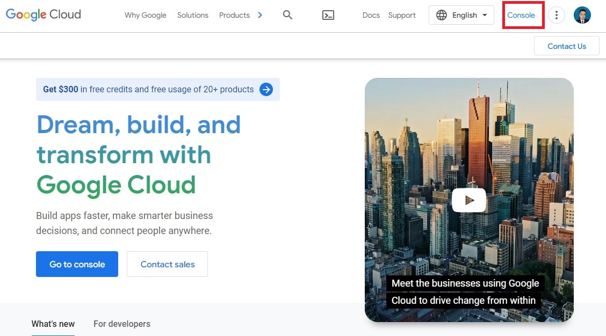


You can view the menu with a list of Google Cloud Products and Services by clicking the **Navigation menu** at the top-left, create **New project**

with the name **Chatbot** 


Then we can visit the 

[https://dialogflow.cloud.google.com/cx/projects](https://dialogflow.cloud.google.com/cx/projects)

then select your Cloud Project name


Click **Enable API**.


Then we Click **Create agent.** If you do not see this page, refresh your browser.


Name your agent **Flight booker** and pick **global** from the Location drop-down. Click **Create**.

and we put `Flight booker`


After creating the agent, navigate to **Agent Settings** > **General** > **Logging settings** and click on **enable stackdriver logging** option. It will generate logs for this agent. Click **Save**.


## Step 2. Create your first Intent

Intents are the reasons an end-user has for interacting with the agent, for example, ordering something. You can create an intent for every topic they may want to navigate. Intents can be reused across Pages and Flows. Each intent is defined by training phrases end-users typically ask. These can be annotated or **labeled** to collect specific parameters, such as arrival city or departure date. 


1. Click **Manage** > **Intents** > **Create** :

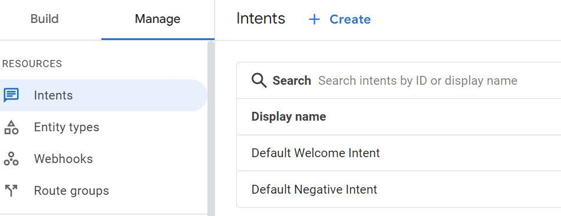

1. Display Name:  `main.book_a_flight`
2. Under the **Training Phrases** header, add each of the following phrases into Dialogflow, click **Enter** after each phrase:

- `Book a flight`
- `Can you book my flight to San Francisco next month`
- `I want to use my reward points to book a flight from Milan in October`
- `My family is visiting next week and we need to book 6 round trip tickets`
- `Four business class tickets from Taiwan to Dubai for June 2nd to 30th`
- `I need a flight saturday from LAX to San Jose`
- `Book SFO to MIA on August 10th one way`
- `Help me book a ticket from 4/10 to 4/15 from Mexico City to Medellin Colombia please`
- `I am booking a surprise trip for my mom, can you help arrange that for May 10th to May 25th to Costa Rica`
- `Do you have any cheap flights to NYC for this weekend`
- `I want to fly in my cousin from Montreal on August 8th`
- `I want to find two seats to Panama City on July 4th`
- `For my wedding anniversary we want to go to Seattle for Christmas`

**Note**: For higher model accuracy, using 20-50 training phrases with short and long response options is recommended.

1. Click **Save**.


1. Some words are highlighted because Dialogflow has automatically labeled the entities, such as a date, place, or number.

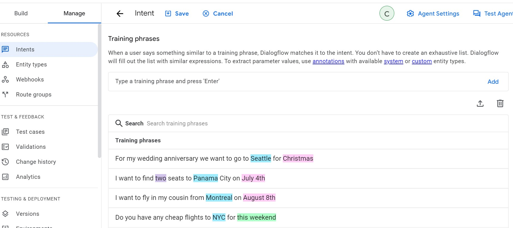

**Note**: You can also add training phrases in bulk by creating a training phrase CSV file and uploading it to Dialogflow.

## Flows and Pages

Flows are used to define topics and the associated conversational paths. Every agent has one flow called the Default Start Flow. 


This single flow may be all you need for a simple agent. More complicated agents may require additional flows, and different development team members can be responsible for building and maintaining these flows.


Every flow starts with a Page, and is made of one or multiple different pages thereafter to handle the conversation within a particular flow. The current page an end-user is on is considered the "active page". Each page can be configured to collect any required information from the end-user.

### Step 3 . Build from your Default Start Flow

The page your agent starts from is called the *Default Start Flow.* Pages store routing logic, responses (known as *Fulfillment*), specific actions to take if an intent cannot be matched (known as *no-match*) or receives *no-input* (which is when the agent does not receive a response in time).

1. Click **Build**.
2. Click **Start** to open the page.

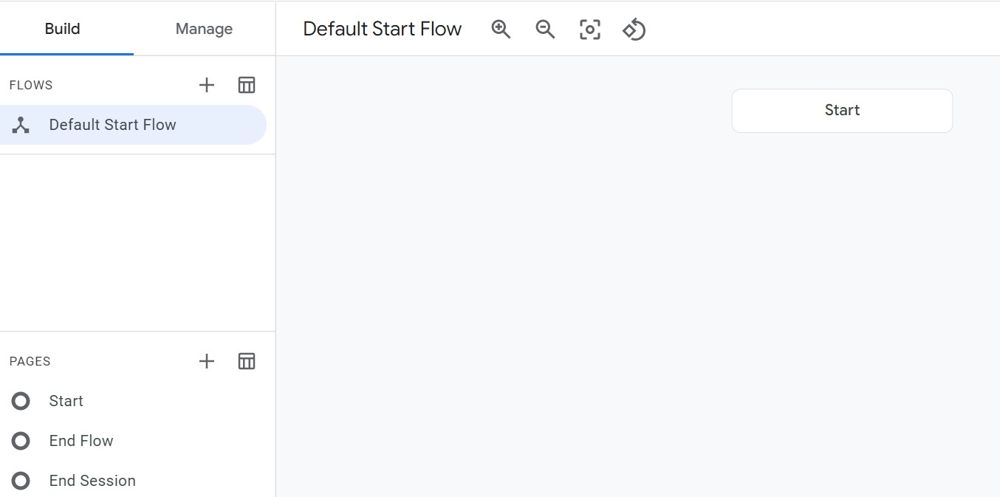

1. From the expanded options on the Start page, select the **+** icon next to **Routes**.


1. Select the intent **main.book_a_flight** from the drop-down, then click **Save**.

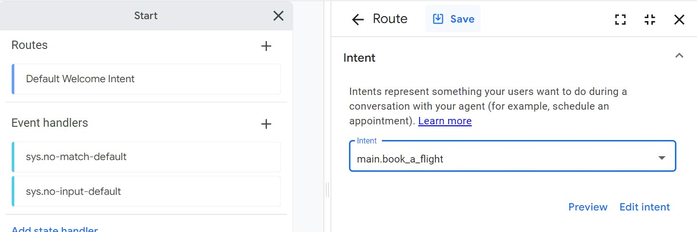

1. Next, in the Routes section, click the **main.book_a_flight** route.

   

   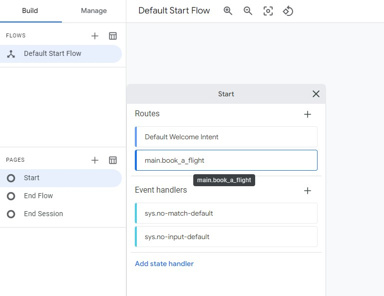

   

2. Scroll down to **Transition**. Choose **+ new Page** from the drop-down. Name the page "Ticket information" and click **Save**.


1. Exit out of the windows to return to the main display of flows to see your new `Ticket information` page connected to the **Start** page.

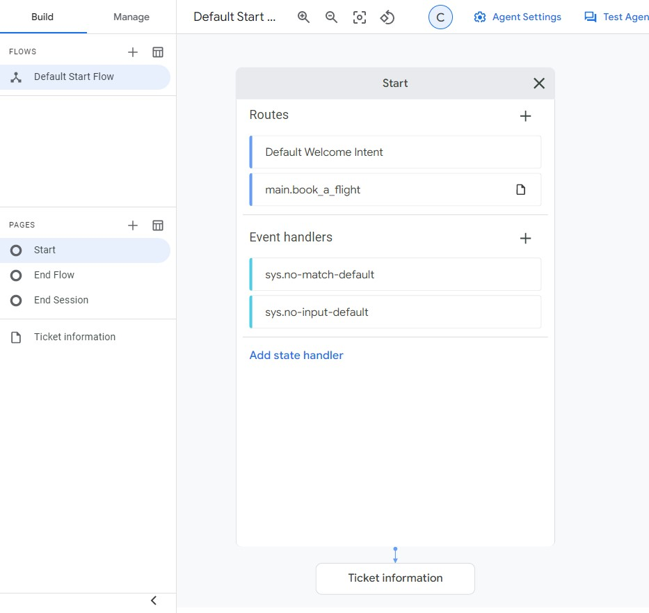


The beginning of the flow now includes a greeting, and will then proceed to the *Ticket information* page when the `main.book_a_flight` intent is matched. On the Ticket Information page you will collect parameters from the end-user so they can book their flight.

## Entities and Parameters

Entities define the type of information you wish to extract from an end-user, ex: city you want to fly to. Use Dialogflow's built-in " system entities'' for matching dates, times, colors, email addresses, and so on. System entities can also be “extended” to include values that are not part of the default system values. If you need to create a fully customized entity, you can do so by creating a Custom Entity type for matching data that is custom to your business and not found as a system entity.

Parameters are information supplied by the end-user during a session, such as date, time, and destination city. Each parameter has a *name* and an *entity type*. They are written in snake_case (lowercase with underscores between words)

### Step 4. Create your first set of Parameters

Next you will use an entity to extract a required parameter from the end-user.

1. Click on the page **Ticket Information**, then the **+** by **Parameters** to collect flight data.

   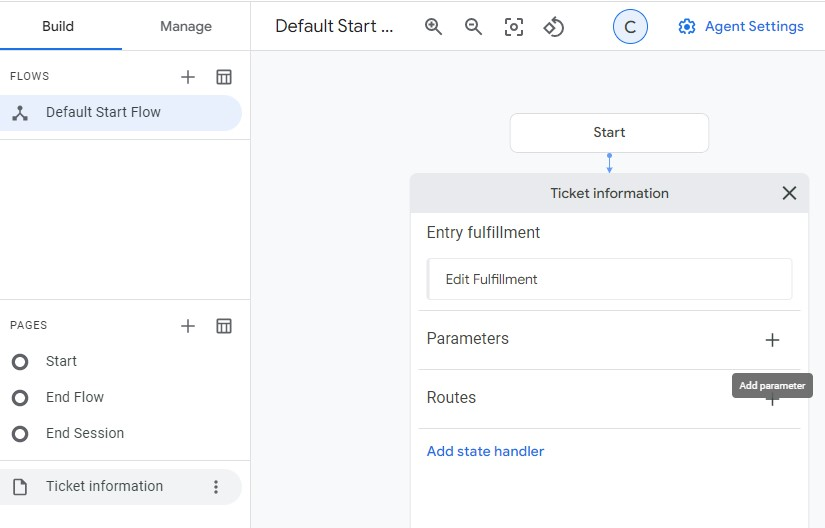

2. Enter `departure_city` in the **Display name** field.

3. Choose **@sys.geo-city** from the **Entity type** drop-down.

4. Scroll down to **Initial prompt fulfillment** > **Agent Says** and add `What city would you like the flight to depart from?`

5. Click **Save**.


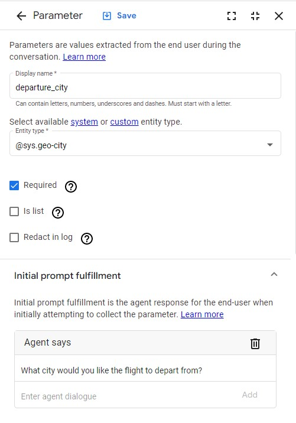

1. Exit out of this window to make another parameter.
2. Click the **+** by **Parameters** again to create 4 additional parameters one by one with the following name, entity type, and how the agent will prompt the end-user.

| Display name     | Entity type   | Agent says                                            |
| :--------------- | :------------ | :---------------------------------------------------- |
| departure_date   | @sys.date     | `What is the month and day of the departure?`         |
| destination_city | @sys.geo-city | `What is your destination city?`                      |
| return_date      | @sys.date     | `What is the month and day for the returning flight?` |
| passenger_name   | @sys.any      | `What is the passenger's name?`                       |

When finished they are listed like this:

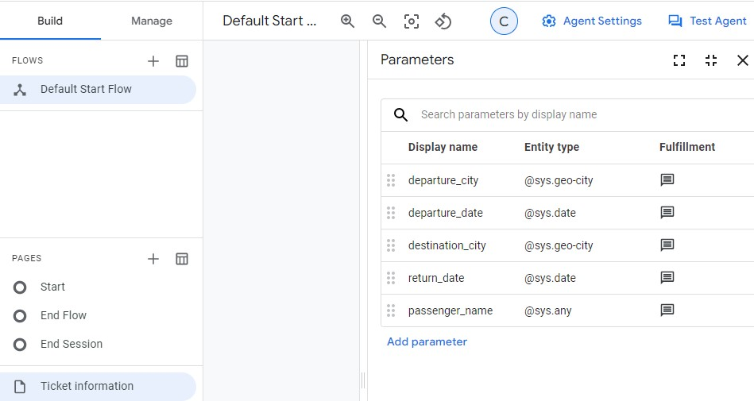

**Note**: The *order* in which the parameters are listed affects the order in which the flight booking agent will ask for each. You can easily change the order by dragging parameters up or down.


## Step 5. Conditions

Once the agent has collected the necessary 5 flight booking parameters, you want to route the end user to another page using a routing [*condition*](https://cloud.google.com/dialogflow/cx/docs/reference/condition), which you will create next.

1. Exit out of the parameter window to return to the **Ticket information** page again.

2. Scroll down to locate **Routes** and click the **+** sign next to it.

   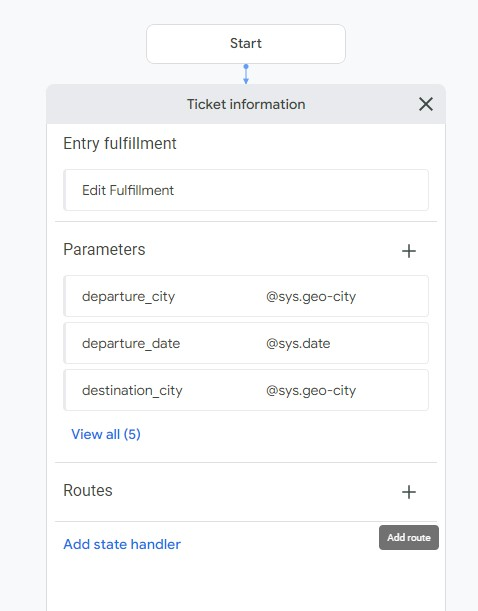

3. Scroll down to **Condition** > **Condition rules** > select "Match **AT LEAST ONE** rule (OR)"

4. In the **Parameter** field enter `$page.params.status`

5. Choose the **=** sign in the **Operand** drop-down.

6. In the **Value** field enter: `"FINAL"` (ensure you include the double quotes).

7. Click **Save**.

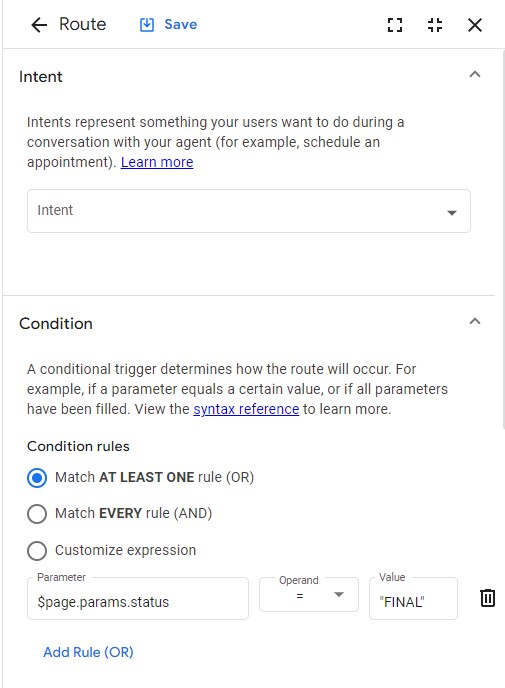


## Step 6. Fulfillment

Now add a response to say to the end-user when all 5 of their booking parameters are collected. These responses are called *Fulfillment*

1. From the condition you just made, scroll down a bit and locate the section called **Fulfillment**.
2. Under **Agent says** type the following: `Thank you for that information. Let me check on the availability of your ticket`.
3. Click **Save.**

(Now stay on this page while you read on to the next step of confirming information.)


## Step 7. Confirming Information

After offering a response (or *fulfillment*), you need to create a transition to a new page that will repeat back to the end-user if the travel information collected (*parameters*) are correct.

1. Continue to scroll down (past the fulfillment you just created) until you reach **Transition**.
2. On the **Page field**, select the drop down to choose **+ new Page**.
3. Type `Confirm trip` in the field called **Page name**.

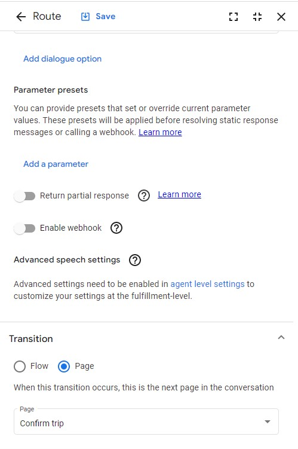

1. Click **Save**.
2. Exit out of the window.
3. Take a look at the flow of your 3 pages.


### Step 8. Repeating back the parameters collected from end-users

[Session Parameters](https://cloud.google.com/dialogflow/cx/docs/concept/parameter#session) store information *previously collected* from the end-user and are active throughout the session. They also help you repeat information back to the end-user.

For example, we can have the agent repeat back a passenger's name: "*Thanks for providing that information, $session.params.passenger_name.*" *This displays to the end-user as "Thanks for providing information, John Day*."

They are formatted as follows:

- *Prefix*: **$session.params.**
- *Entity Name:* **passenger_name**

So referencing the departure city would look like: $session.params.departure_city

1. Starting from the Build view, click on the **Confirm Trip** page > **Entry fulfillment** > **Edit fulfillment** field.

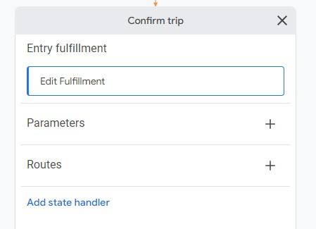

1. Since you used 5 parameters, you can repeat them back to the user via the following session parameters.

Paste the following text within the **Agent says** section:

```
This is to confirm that $session.params.passenger_name will fly
From: $session.params.departure_city
To: $session.params.destination_city
Leaving on: $session.params.departure_date
Returning on: $session.params.return_date
Is this correct?
```

Copied!

content_copy


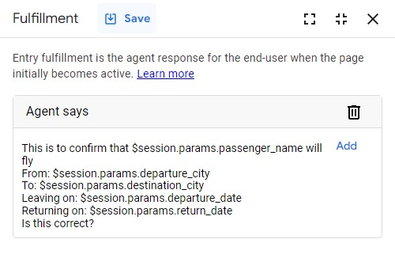

1. Then click **Save.**
2. This is what it will look like to the end-user when the virtual agent repeats back the collected session parameters:


### Step 9. Positive Confirmation Route

1. Exit out of the window to return to your **Confirm Trip** page. Click **+** next to **Routes.**

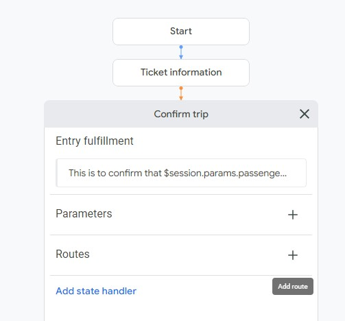

1. Click the *Intents drop-down* , then click **+ new Intent.**

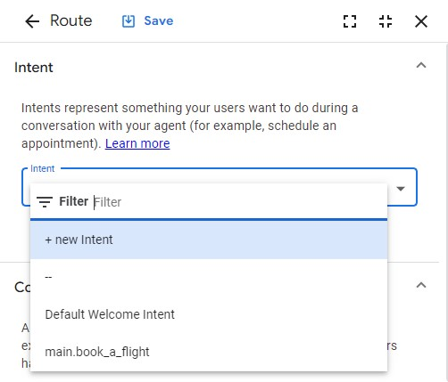

1. In Display name type `confirmation.yes`.
2. In Training phrases enter `yes` then **Enter** (you can add more phrases like `correct`, `yup`, etc., to improve the NLU matching for this intent).

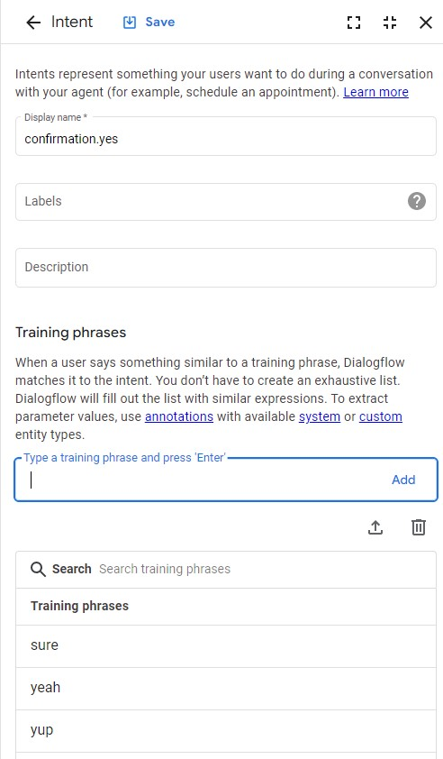

1. Click **Save**.
2. After saving, scroll down to the **Fulfillment** section and enter `Great, your flight is booked!`

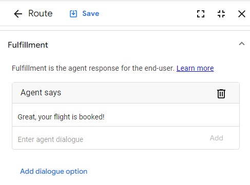

1. Then click **Save.**
2. Click the back arrow, next to **Route**.


### Step 10. Negative Confirmation Route

Now add logic to route an end-user to recollect their flight parameters if they say the information is incorrect.

1. Still on the Routes section select **Add route**.

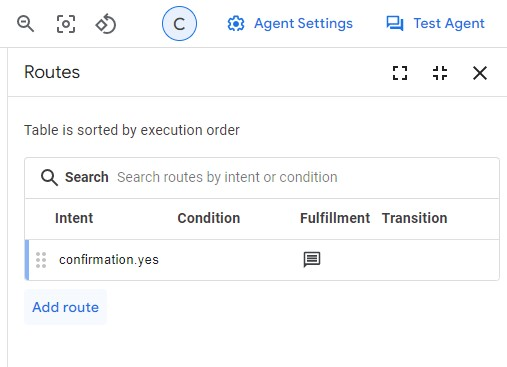

1. From the Intents drop-down choose **+ new Intent**.
2. Name the intent `confirmation.no` in the Display name field.
3. Scroll down to the Training phrases section type "**no**" then click **Enter.**

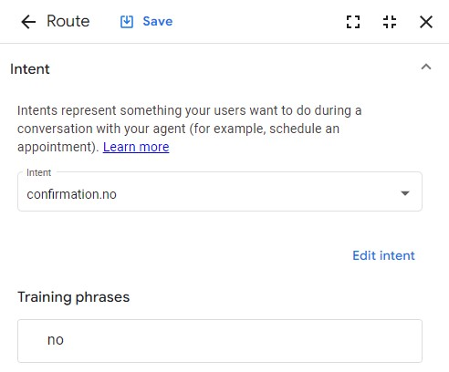

Click **Save.**

1. Next, scroll down to the section called **Transition** > **Page**, then choose **Ticket information** from the drop-down.

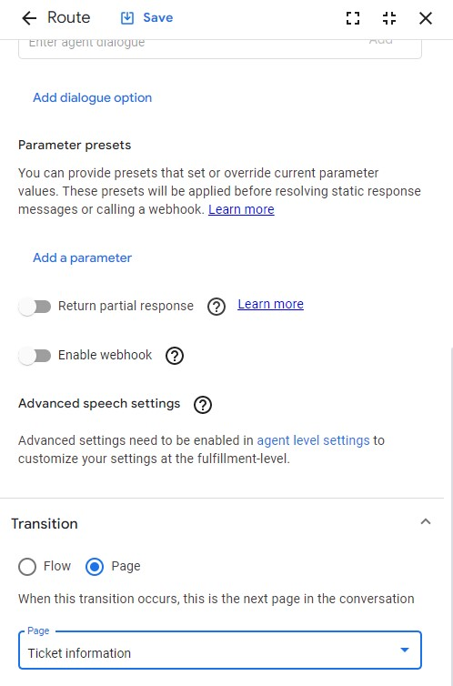

**Note**: This is to prompt the user again for their flight information.

1. Scroll up to **Parameter presets** and click **Add a parameter** . 

   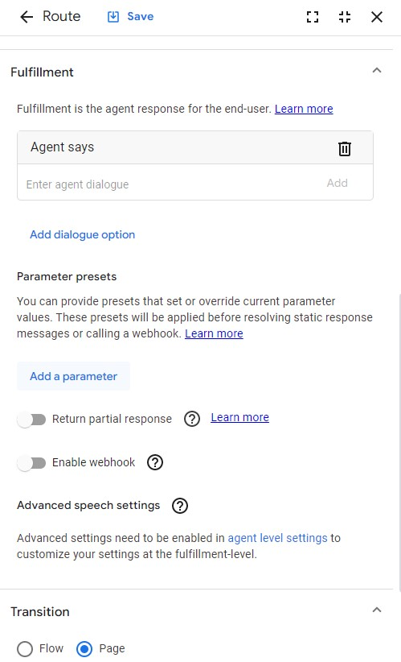

1. Enter the following *5* values and assign their value to **null** *without* the quotation marks. **Note**: you will need to delete the quotation marks in the value column and type *null.* This is to delete the parameters collected from the end-user.

| **Parameter**      | **Value** |
| :----------------- | :-------- |
| `departure_city`   | null      |
| `destination_city` | null      |
| `departure_date`   | null      |
| `return_date`      | null      |
| `passenger_name`   | null      |


The purpose of this is to remove the value that was previously collected from the end user to allow them to submit a new value. If this step is missed, it might result in an infinite loop scenario in your bot!

1. Click **Save.**
2. Exit out of the window to return to the Build view, you will now see how all 3 pages flow. Note that the last page has two arrows between the Confirm trip and Ticket information page because the `confirmation.no` intent is linked back.

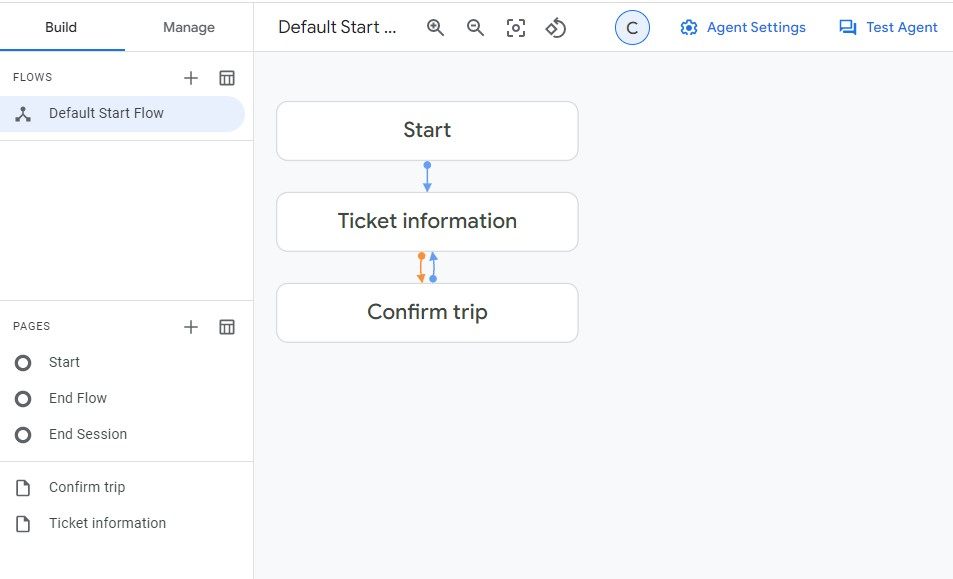

## Step 11. Testing

To test that your agent works as intended, click on **Test Agent** in the upper right corner of the screen. Interact with the agent as if you were the end-user. As you move through the main flow, notice the pages, intents, and transitions you created.


Depending on how you arranged your parameter collection, you can try typing in the following sample dialogue:

- I'd like to book a flight
- New York
- Tomorrow
- Boston
- Next Friday
- Mickey Mouse
- Yes

This should result in a successful transaction through your agent, commonly known as the “happy path”.

Here is an example of the above agent testing in the Test Agent console:

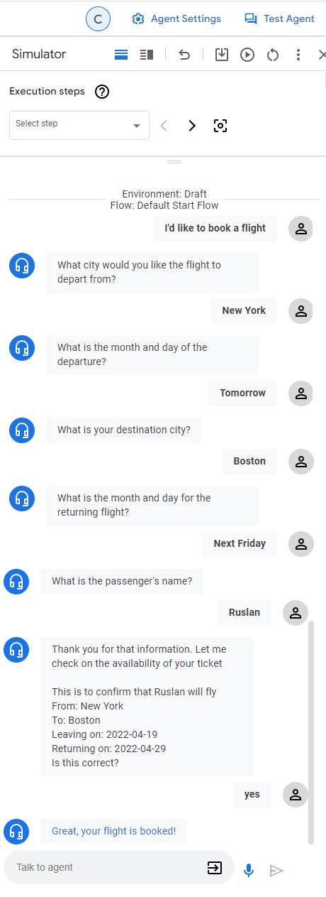


## Exporting Your Agent

When you build an agent for one project, you can export it to use in a different project. You can export your agent and save it to use in future labs or to continue building in your own personal project!

1. In the **Agent** drop down at the top of the Dialogflow CX console, click **View all agents**.

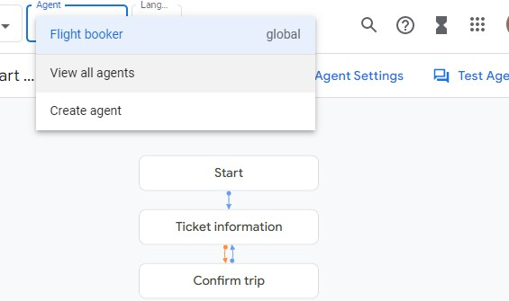


1. On the Agent list screen, click the context menu next to your agent and then click **Export**.

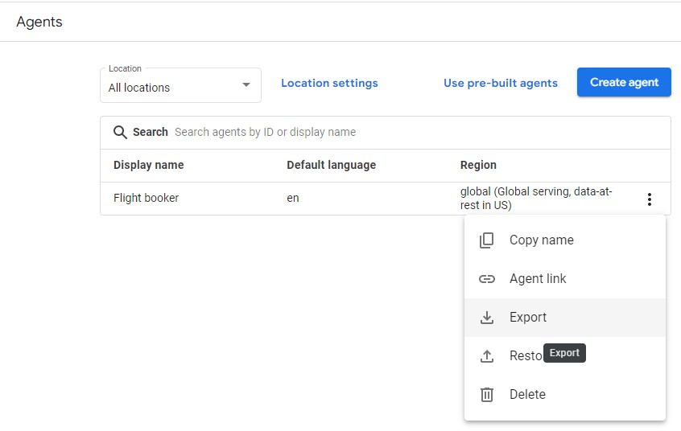

1. On the Export Agent screen, choose **Download** to local file, then click **Export**.

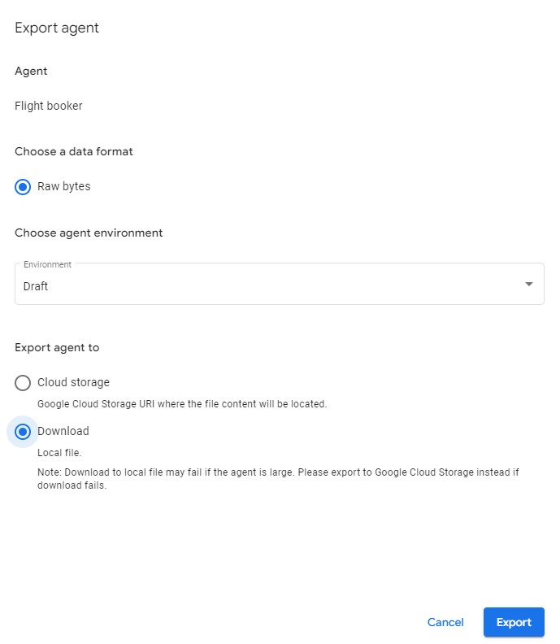

## Congratulations

You have built a Dialogflow CX Agent and learned some basic concepts.

